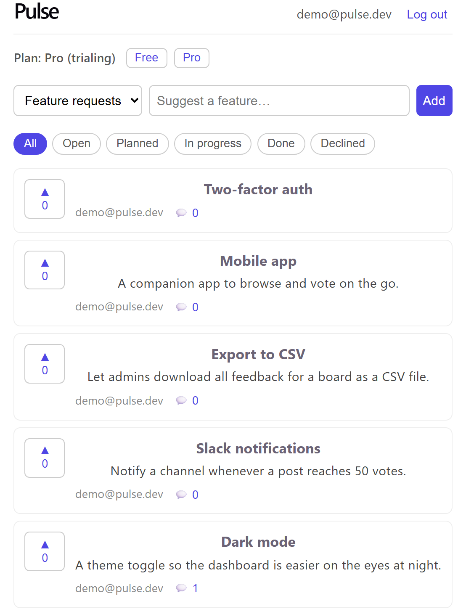
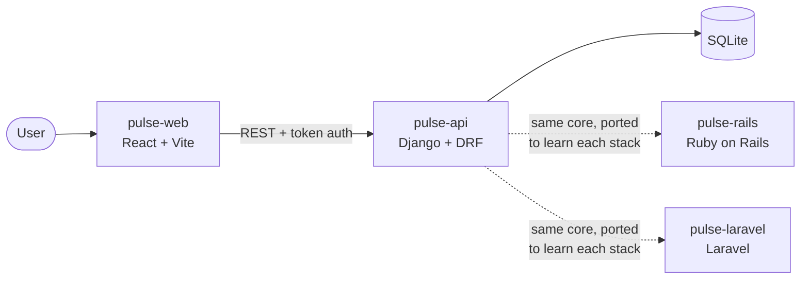

<!--
  GitHub profile README — lives in the public repo Jorgepele/Jorgepele
  and renders at the top of https://github.com/Jorgepele
-->

## Hi, I'm Jorge 👋

I'm a Computer Engineering student at the **University of Murcia** (Spain).

I'm early in my path as a developer: most of what I've written so far has been for
coursework, and right now I'm focused on turning that theory into small projects that
actually run — mostly on the backend. I learn best by building, so this profile will
grow as I do.

**Languages I've worked with (coursework):** Python · Java · C++ · SQL

**Learning right now:** Django · REST APIs · the MVC pattern · JavaScript &amp; React ·
comparing MVC frameworks (Rails, Laravel) · Git &amp; GitHub

### What I'm building

**Pulse** — a small feedback &amp; roadmap app (teams post feature requests, users upvote and
comment), built to learn full-stack web development beyond coursework. It's live on Render:

**Live demo: https://pulse-web-lvhx.onrender.com** — log in with `demo@pulse.dev` / `demo12345`

- **[pulse-api](https://github.com/Jorgepele/pulse-api)** — the Django + REST Framework
  backend: multi-tenant data modelling, a token-authenticated REST API, and tests.
- **[pulse-web](https://github.com/Jorgepele/pulse-web)** — the React + Vite frontend that
  consumes it.

To learn how the same ideas map across frameworks, I ported Pulse's core to two more:

- **[pulse-rails](https://github.com/Jorgepele/pulse-rails)** — the same domain in **Ruby on
  Rails** (Active Record, token auth via an `Authorization: Token` header), as a way into Rails'
  conventions.
- **[pulse-laravel](https://github.com/Jorgepele/pulse-laravel)** — and in **Laravel** (Eloquent,
  Sanctum), to compare it with Django and Rails.

Plus **[fp-kit](https://github.com/Jorgepele/fp-kit)** — a small functional-programming library
(compose/pipe/curry, Maybe/Result) I built to practise the functional style.

Very much a work-in-progress and a place to learn in the open. The Rails and Laravel ports are
recent learning projects — I'm more confident in Python than in either yet, and say so in each repo.

### En español

Estudiante de Ingeniería Informática en la Universidad de Murcia. Tengo bases teóricas y
prácticas en Python, Java, C++ y SQL, y en arquitectura MVC y APIs REST. Estoy dando el
salto de los proyectos académicos a construir cosas reales, aprendiendo desarrollo web
(Django y React) por el camino. Mi proyecto **Pulse** está desplegado y se puede probar en
vivo: https://pulse-web-lvhx.onrender.com (`demo@pulse.dev` / `demo12345`). Para aprender cómo
se traslada el patrón MVC entre frameworks, he portado su núcleo a **Rails** y **Laravel**
(son proyectos de aprendizaje recientes; soy más sólido en Python que en ellos, y lo digo en
cada repo). Abierto a prácticas y a mi primera oportunidad en el sector.

---

Reach me at **jogpgc@gmail.com**
